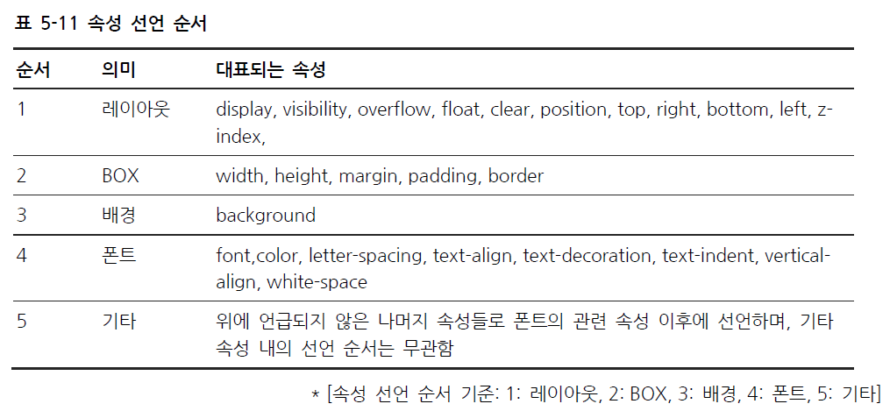

# CSS Flexbox




```css
.flex-container {
  display: flex;
}
```

> display: flex; 를 통해 flexbox class 를 지정할 수 있다. 이 클래스에서 파생된 자식 클래스는 따로 다시 지정해주지 않아도 flexbox의 속성을 가진다.


## CSS Flex Container

> 부모 요소에서 쓸 수 있는 property 모음이다.


### flex-direction

```css
.flex-container {
  display: flex;
  flex-direction: column;
}
```

* flex item을 정렬하는 방식을 정의한다.
* column: 세로방향
* column-reverse:  세로방향 역순
* row: 가로방향
* row-reverse: 가로방향 역순


### flex-wrap

```css
.flex-container {
  display: flex;
  flex-wrap: wrap;
}
```

* 어떤 방식으로 wrap 할지 정의한다
  * 윈도우 사이즈가 변경되었을 경우 등에 대비할 수 있다.
* wrap: 필요할 경우 줄바꿈을 해준다
* nowrap: 줄바꿈 안함
* wrap-reverse: 줄바꿈 역순


### flex-flow

```css
.flex-container {
  display: flex;
  flex-flow: row wrap;
}
```

* flex-direction + flex-wrap 을 합쳐서 짧게 쓸수 있는 property다.
* row wrap, column-reverse nowrap 등의 형식으로 사용할 수 있다.


### justify-content

```css
.flex-container {
  display: flex;
  justify-content: center;
}
```

* flex item간의 사이을 정렬하기 위한 property
* center: 중앙정렬
* flex-start, flex-end: 앞, 뒤 정렬
* space-around: 4방향의 공간을 일정하게 정렬
* space-between: flex item간의 공간을 일정하게 정렬


### align-items

```css
.flex-container {
  display: flex;
  height: 200px;
  align-items: center;
}
```

* flex container 안에서의 flex item의 위치를 정렬한다.
* center: container 중앙에 정렬한다
* flex-start, flex-end:  container의 위, 아래에 정렬한다
* stretch: item을 늘려서 container에 맞춘다
* baseline: item의 중앙선을 기준으로 정렬한다. 


### align-content

```css
.flex-container {
  display: flex;
  height: 600px;
  flex-wrap: wrap;
  align-content: space-between;
}
```

* 사이와 주변의 공간 분포를 설정한다.
* space-between:  flex item간의 공간을 일정하게 정렬
* space-around: 4방향의 공간을 일정하게 정렬
* stretch: item을 늘려서 container에 맞춘다
* center: container 중앙에 정렬한다
* flex-start, flex-end:  container의 위, 아래에 정렬한다


## CSS Flex Items

> 자식 요소에서 쓸 수 있는 property 모음이다.


### order

```html
<div class="flex-container">
  <div style="order: 3">1</div>
  <div style="order: 2">2</div>
  <div style="order: 4">3</div>
  <div style="order: 1">4</div>
</div>
```

* item의 순서를 정할수 있다. 


### flex-grow

```html
<div class="flex-container">
  <div style="flex-grow: 1">1</div>
  <div style="flex-grow: 1">2</div>
  <div style="flex-grow: 8">3</div>
</div>
```

* item의 상대적 크기를 정할 수 있다.
  * 위의 경우 3이 1과 2보다 8배 빠르게 성장한다.


### flex-shrink

```html
<div class="flex-container">
  <div>1</div>
  <div>2</div>
  <div style="flex-shrink: 0">3</div>
  <div>4</div>
  <div>5</div>
  <div>6</div>
  <div style="flex-shrink: 3">7</div>
  <div>8</div>
  <div>9</div>
  <div>10</div>
</div>
```

* item의 상대적 크기를 정할 수 있다.
  * 위의 경우 3은 축소하지않는다. 7은 3배 빠르게 축소한다.


### flex-basis

```html
<div class="flex-container">
  <div>1</div>
  <div>2</div>
  <div style="flex-basis: 200px">3</div>
  <div>4</div>
</div>
```

* item의 초기 크기를 설정 할 수 있다.


### flex

```html
<div class="flex-container">
  <div>1</div>
  <div>2</div>
  <div style="flex: 0 0 200px">3</div>
  <div>4</div>
</div>
```

* 위 3가지 property를 한번에 사용할 수 있다.


### align-self

```html
<div class="flex-container">
  <div>1</div>
  <div>2</div>
  <div style="align-self: center">3</div>
  <div>4</div>
</div>
```

* align-items의 기능을 개별 item 단위로 설정하는것.


